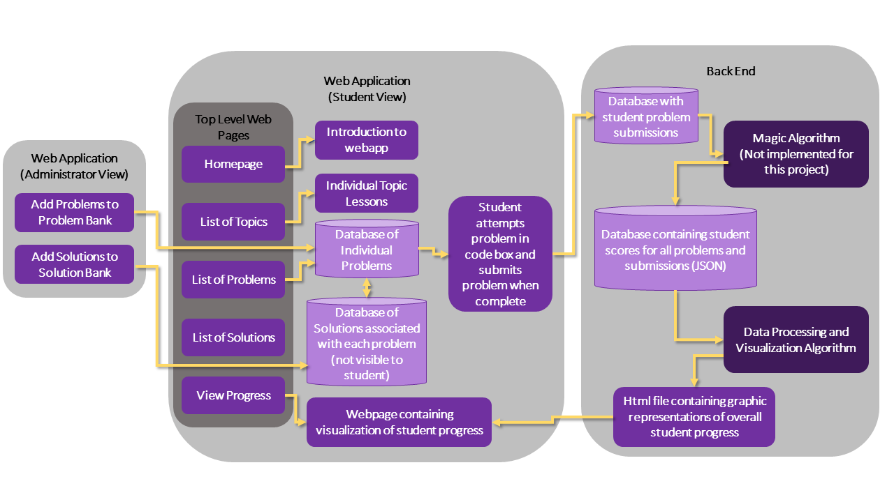

# User Stories

## User 1: Carolyn, Student learning CS independently
This student will want to select topics to learn, look through their learning progress, and select specific problems for practice. This student will need to do problems, and submit their problems to the app for grading. Carolyn is not expected to be super technically skilled and will have an interface that does not require code or terminal commands.
### User 1 Cases
- View available topics to learn
- View learning progress
- View problem bank
- Submit problems
- View solution

## User 3: Yilin, Site Administrator
Yilin will want to view the studet view of the site, as well as the backend. She will need to add problems and solutions to the database, edit webpages, and add contact. She will need access to the entire website backend. Yilin is expected to have sufficient knowledge of Django to make these changes, as she will be in charge of the site's maintenance. 
### User 3 Cases
- View available topics to learn
- View student version of website (includes all of User 1 Cases)
- View admin version of website
- Create problems
- Create solutions
- Edit magic algorithm 
- Edit data processing algorithm

# Use Cases

### 'Magic' Algorithm
#### _Name:_ mag_alg
#### _What it does:_ recieves data from submit_prob and compares it to a database of submitted solutions. JSON format
#### _Inputs (with type information):_ Problems submitted by student in submit_prob (type: python file)
#### _Outputs (with type information):_ JSON data with specified TBD schema (type: JSON)

### Data Processing and Analysis Algorithm
#### _Name:_ data_alg
#### _What it does:_ Takes the data processed by the magic algorithm and generates visualizations of student progress based on scores.
#### _Inputs (with type information):_ JSON data from mag_alg with problem scores by topic (type: JSON)
#### _Outputs (with type information):_ Visualization of student progress based on topic scores (type: .html file)

### View Available Topics to Learn
#### _Name:_ v_avail_topic
#### _What it does:_ When a user navigates to this page/tab on the app it will populate a list of available topics. Each topic will have a sub-webpage which contains a lesson for that topic.
#### _Inputs (with type information):_ Navigation to webpage (select a hyperlink on webpage)
#### _Outputs (with type information):_ Viewing an html webpage which contians all topics available to learn, and links to subpages with lessons. (type: html file)

### View Learning Progress
#### _Name:_ v_learn_prog
#### _What it does:_ A webpage showing the visualization of the student't learning process.
#### _Inputs (with type information):_ html file output from data_alg (type: html file)
#### _Outputs (with type information):_ Webpage which contains graphic representations of learning process. (type: html file)

### View Problem Bank
#### _Name:_ v_prob_bank
#### _What it does:_ A webpage containing links to all available problems for practice. They are labelled according to topic.
#### _Inputs (with type information):_ Problems from database (type: )
#### _Outputs (with type information):_ A webpage containing links to the problem description/submission page (type: html file)

### Submit Problems
#### _Name:_ submit_prob
#### _What it does:_ Webpage with codeblock a student can fill with python code and hit submit. Will move student submission into submitted problems database, and send that submission into the magic algorithm for grading.
#### _Inputs (with type information):_ Student problem answers (type: .py file)
#### _Outputs (with type information):_ Student problem answers (type: .py file)

### View Solution
#### _Name:_ v_soln
#### _What it does:_ EVENTUALLY: Student Solution will be marked as correct or not correct from grade_work. Pulls data from 'magic' algorithm to provide feedback to the student on their submittions performance/accuracy. FOR THE PURPOSES OF THIS CLASS: Webpage showing student submissions. Inputs and outputs are based on "eventually"
#### _Inputs (with type information):_ results from submit_prob: (type: .py file)
#### _Outputs (with type information):_ Student's submission and their scores for each topic (type: user interface)

### Create Problems
#### _Name:_ c_prob
#### _What it does:_ Add problems to the problem bank.
#### _Inputs (with type information):_ problem description (type: str, and .py - if they want to provide skeleton code), problem solution (type: .py), test cases (type: numpy array or python list)
#### _Outputs (with type information):_ Information from input is added to the problem database as a new problem which can be selected for practice (type: python list, .py)

### Create Solutions
#### _Name:_ c_prob
#### _What it does:_ Add solutions to the solution bank.
#### _Inputs (with type information):_ problem solution (type: .py), unit tests for problem (type: .py file)
#### _Outputs (with type information):_ Information from input is added to the solution dataase (type: python list, .py)

# Component Specs
There are four primary components to our system design:
1. A concept inventory of practice programming questions, separated by topic, for students and teachers to use.
2. A web application (including database on the back end and usable application on the front end).
3. A "magic algorithm" which takes student soltions as input and outputs a JSON file of data which contains information about student mastery of each topic. This algorithm is out of scope for the current system, and its output will be synthetically generated.
4. A data processing and analysis algorithm which takes the above JSON data and outputs relevant statistics and visualizations for the user.

At a high level, questions will be stored in the database and displayed on the web application. As users complete questions, data will be continuously POSTed to the back end servers, and passed along to the magic algorithm (not being implemented currently), which in turn outputs JSON data containing information aboutuser progress on each topic. This data is then fed into a processing and analysis algorithm on the backend, whose results are finally displayed on the front end to users. A visual of this design is provided below.

