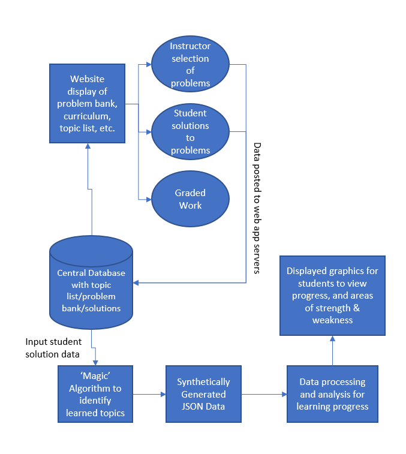

# User Stories

## User 1: Carolyn, Student learning CS independently
This student will want to select topics to learn, look through their learning progress and receive an analysis report, and select specific problems for practice. THis student will need to do problems, and submit their problems to the app for grading. Carolyn is not expected to be super technically skilled and will have an interface that does not require code or terminal commands.
### User 1 Cases
- View available topics to learn
- View learning progress
- View problem bank (problems should be tied to topics)
- Submit problems
- View solution

## User 2: Nikolay, Student Learning CS in Class
Nikolay will want to do everything that the above user does, but additionally view feedback and grades from the teacher, as well as submit work directly to the teacher. Nikolay is similarly not expected to interact with the program using code or terminal commands.
### User 2 Cases
- View curriculum
- View learning progress
- View assignments
- Submit problems
- View solution
- View teacher feedback

## User 3: Yilin, Teacher Using This to Teach CS
Yilin will want to evaluate student progress, view their solutions/submitted work, provide feedback to students, and select topics/problems which will be used for their curriculum. The teacher is expected to have some more knowledge, and it might be helpful to give the teacher the ability to interact with the program at a lower level of abstraction to add/remove problems.
### User 3 Cases
- Create curriculum
  - Specify problems from problem bank to include in curriculum
- View problem bank
- View available topics to learn
- View curriculum
- View student learning progress
- Create assignments
- View assignments
- View student problems
- View solution
- Provide feedback

# Use Cases

### 'Magic' Algorithm
#### _Name:_ mag_alg
#### _What it does:_ recieves data from submit_prob and compares it to a list of submitted solutions. JSON format
#### _Inputs (with type information):_ Problems submitted by student in submit_prob *(type: WHAT TYPE WOULD THIS BE?)*
#### _Outputs (with type information):_ JSON data with specified TBD schema (type: JSON)

### Data Processing and Analysis Algorithm
#### _Name:_ data_alg
#### _What it does:_
#### _Inputs (with type information):_ JSON data from mag_alg with specified TBD schema (type: JSON)
#### _Outputs (with type information):_ Bearkdown of student performance that can be used to generate plots in other use cases (type: numpy array)

### View Available Topics to Learn
#### _Name:_ v_avail_topic
#### _What it does:_ When a user navigates to this page/tab on the app it will populate a list of available topics. Topics the user has already learned/mastered/marked as complete will be labelled as such to make it easy for the user to see what they have done and what they need to do.
#### _Inputs (with type information):_ List of topics (type: python list), Topics user has completed (type: python list, can make this another column of the list of topics - mark a topics as 1 if completed or 0 if not completed), whether or not a refresh button has been pressed, similar to the degree audit on myplan (type: boolean, whether or not a key is pressed) - alternative to the refresh button is auto-refreshing the list.
#### _Outputs (with type information):_ A list of topics which clearly indicates which have been completed and which hasn't (type: python list in a UI), these topics can be selected to navigate user to practice problems/instruction on that topic.

### View Learning Progress
#### _Name:_ v_learn_prog
#### _What it does:_ Generates graphics to display learning progress of student. Shows what they have learned, what they need to learn, areas they have struggled or excelled in, maybe amount of time spent in several areas, and relative size of a topic. Similar to the plots a Jira Dashboard would produce.
#### _Inputs (with type information):_ Results from the Data Processing and Data Analysis Algorithms (type: TBD, but likely numpy arrays or dataframes)
#### _Outputs (with type information):_ Clear, readable graphical representations of student progress. Should be able to help them identify areas of strengths and weaknesses and develop a learning plan from. (type: plots)

### View Problem Bank
#### _Name:_ v_prob_bank
#### _What it does:_ When a user navigates to this page/tab on the app it will populate a list of available practice problems. These problems will be sorted by topic, user should be able to filter based on topic, level of difficulty, and problem size.  Problems the user has already completed will be labelled as such to make it easy for the user to see what they have done and what they need to do (or they won't display at all).
#### _Inputs (with type information):_ List of problems (type: python list with several columns for each filter), Topics user has completed (type: python list, can make this another column of the list of topics - mark a topics as 1 if completed or 0 if not completed), whether or not a refresh button has been pressed, similar to the degree audit on myplan (type: boolean, whether or not a key is pressed) - alternative to the refresh button is auto-refreshing the list.
#### _Outputs (with type information):_ A list of problems which clearly indicates which have been completed and which hasn't (type: python list in a UI), these problems can be selected to navigate user to problem description/solution page.

### Submit Problems
#### _Name:_ submit_prob
#### _What it does:_ Student attached/inputs their problem solution to the app to be 'graded' (marked as correct or not). Solution goes into the magic algorithm which determines whether or not their solution is correct and eventually (out of the scope of this course) identifies where the student's answer is incorrect *(CHECK THIS WITH GROUP)*.
#### _Inputs (with type information):_ Student problem answers (type: .py file, or copy pasting into an interface like LeetCode)
#### _Outputs (with type information):_ Student problem answers which feed into grade_work (type: .py file, or copy pasting into an interface like LeetCode)

### Grade Work
#### _Name:_ grade_work
#### _What it does:_ Takes problems from submit_prob and uses test cases to determine if the students work performs correctly. If the student's work provides the correct answers from the test cases, their work will be marked as correct. Otherwise it will be fed into the 'magic' algorithm which will evaluate their solution and provide feedback on where the student made errors.
#### _Inputs (with type information):_ Student problem answers (type: .py file, or copy pasting into an interface like LeetCode)
#### _Outputs (with type information):_ Whether student solution is correct or not (type: boolean), basic feedback on solution (type: simple error messages e.g. syntax), solution to be sent to v_soln for viewing and 'magic' algorithm for further analysis (.py file, or other interface)

### View Solution
#### _Name:_ v_soln
#### _What it does:_ Student Solution will be marked as correct or not correct from grade_work. Pulls data from 'magic' algorithm to provide feedback to the student on their submittions performance/accuracy.
#### _Inputs (with type information):_ results from grade_work: (type: boolean, correct or not), (type: simple error messages, basic feedback on solution)
#### _Outputs (with type information):_ Information about student's solution from grade_work for the student to see. (type: user interface)

### Create Curriculum
#### _Name:_ c_curr
#### _What it does:_ A teacher/tutor/curriculum developer can view the list of available topics (using v_avail_topic) and the problems associated with those topics (using v_prob_bank). From this the user can select which topics and problems they want included in their curriculum, mark deadlines for problems and topics, and build a curriclum to be sent to students.
#### _Inputs (with type information):_ v_avail_topic (type: python list), v_prob_bank (type: python list)
#### _Outputs (with type information):_ topics for curriculum and timeline (type: python list, two columns min), problems associated with topics and deadlines (type: python list, two columns min)

### View Curriculum
#### _Name:_ v_curr
#### _What it does:_ Shows the curriculum and deadlines in the form of a syllabus for the student. Model after syllabus page for this class.
#### _Inputs (with type information):_ c_curr outputs to put into a table (type: python list). Allows for teacher to add content to cells (like lecture videos/slides)
#### _Outputs (with type information):_ Without added teacher content: A table/calendar which shows topic timelines and assignment deadlines. If teacher adds content, that will also display in the cells (type: dataframe).

### Create Problems
#### _Name:_ c_prob
#### _What it does:_ If teacher wants to add to the existing problem bank, they can! They can provide a problem, solution, and test cases (with answers) and it will be added to the problem bank for anyone to see (open souce problem bank).
#### _Inputs (with type information):_ problem description (type: str, and .py - if they want to provide skeleton code), problem solution (type: .py), test cases (type: numpy array or python list)
#### _Outputs (with type information):_ Information from input is added to the prob_bank as a new problem which can be selected for practice (type: python list, .py)

### Create  and View Feedback for Students
#### _Name:_ c_feedback
#### _What it does:_ When a teacher v_soln for students they have a textbox where they can provide feedback for students to see.
#### _Inputs (with type information):_ Student feedback from textbook (type: str)
#### _Outputs (with type information):_ Displays feedback on the problem solution page which both the student and teacher can see (type: str)

### View Student Learning Process
#### _Name:_ v_s_learn_prog
#### _What it does:_ Very similar to view learning progress (v_learn_prog) except you can filter based on the students in your class, or generate graphics for your class as a whole. Generates graphics to display learning progress of student(s). Shows what they have learned, what they need to learn, areas they have struggled or excelled in, maybe amount of time spent in several areas, and relative size of a topic. Similar to the plots a Jira Dashboard would produce.
#### _Inputs (with type information):_ Results from the Data Processing and Data Analysis Algorithms for student(s)/class *(ASK GROUP MAYBE JUST ONE OF THEM)* (type: TBD, but likely numpy arrays or dataframes)
#### _Outputs (with type information):_ Clear, readable graphical representations of student(s)/class progress. Should be able to help them identify areas of strengths and weaknesses. (type: plots)

# Component Specs
There are four primary components to our system design:
1. A concept inventory of practice programming questions, separated by topic, for students and teachers to use.
2. A web application (including database on the back end and usable application on the front end).
3. A "magic algorithm" which takes student soltions as input and outputs a JSON file of data which contains information about student mastery of each topic. This algorithm is out of scope for the current system, and its output will be synthetically generated.
4. A data processing and analysis algorithm which takes the above JSON data and outputs relevant statistics and visualizations for the user.

At a high level, questions will be stored in the database and displayed on the web application. As users complete questions, data will be continuously POSTed to the back end servers, and passed along to the magic algorithm (not being implemented currently), which in turn outputs JSON data containing information aboutuser progress on each topic. This data is then fed into a processing and analysis algorithm on the backend, whose results are finally displayed on the front end to users. A visual of this design is provided below.

